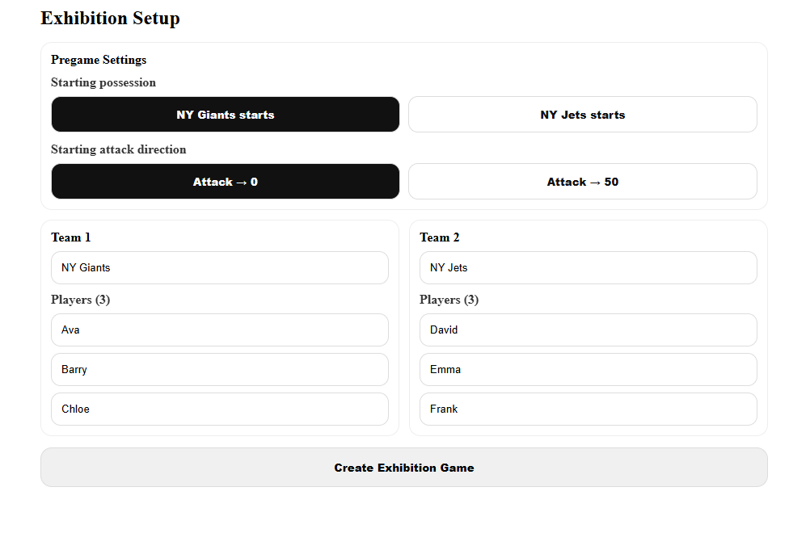
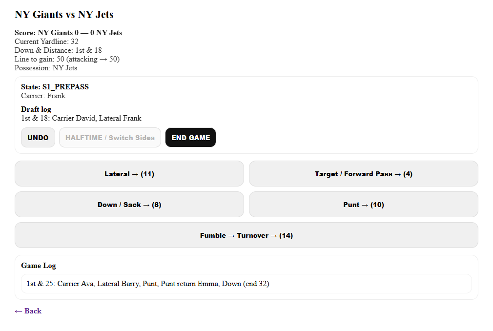
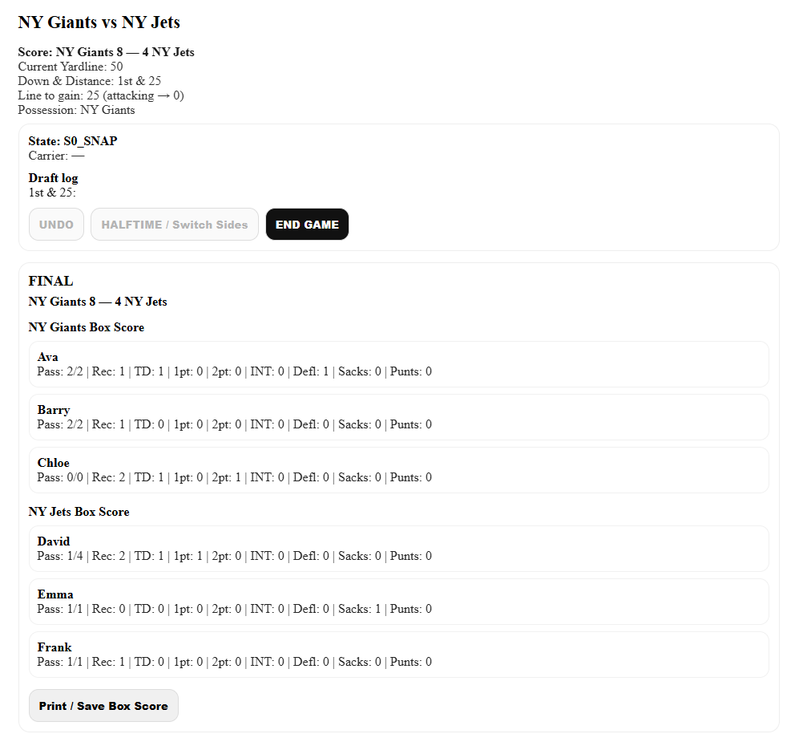
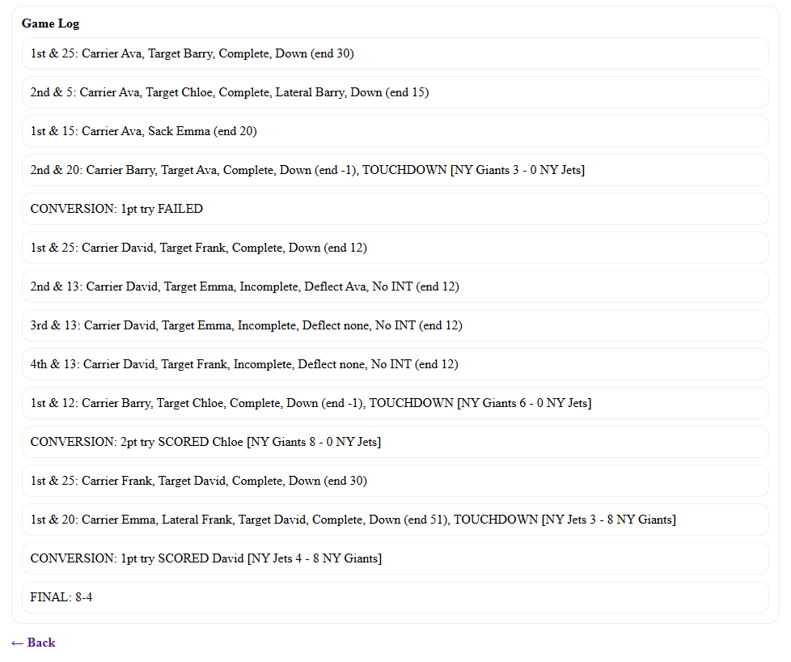

# 3v3 Football Statkeeper

Football Statkeeper is built and used in a small winter/summer 3v3 football league with personalized rules (for the smaller 3v3 game). The main purpose is to log game results live and in-person with an easy-to-use button system, and then have the ability to saved finished game logs and box score stats at the end of the game.

## Features

- Create exhibition games with two custom-named teams
- Add custom-named player rosters for both sides
- Track live game events and score
- Structured game flow built with a state-machine-style architecture, ensuring clear transitions between phases and reliable state management
- Automatically update player stats during gameplay
- Undo recent actions
- End the game and view a final box score
- Print or save the final game summary
- Local-first storage using browser localStorage

## Tech Stack

- Next.js
- React
- TypeScript
- LocalStorage

## Why I Built This

I built this for a personal 3v3 backyard football league with our own personalized rules. The goal was to make a fast, simple statkeeping tool that could run locally and handle live game logging without needing accounts or a backend.

## Screenshots

### Setup


### Live Game


### Final Box Score / Game Log



## Getting Started

Clone the repo and run locally:

```bash
git clone https://github.com/YOUR_USERNAME/flag-football-statkeeper.git
cd flag-football-statkeeper
npm install
npm run dev
